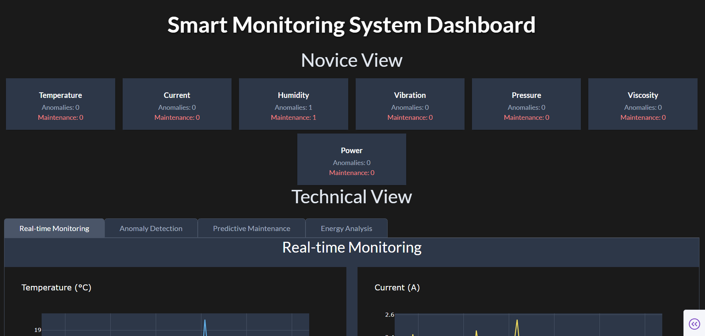
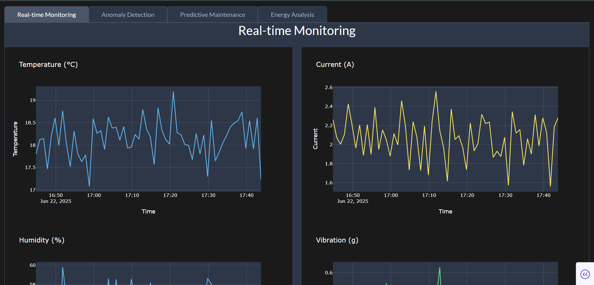
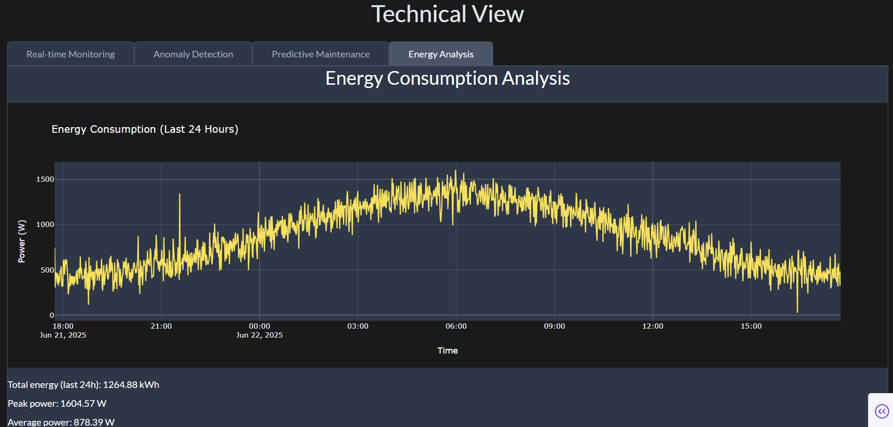

# Smart Monitoring System - ML and Visualization

This project implements machine learning models and visualization components for a smart monitoring system that analyzes temperature and current data from ESP32 sensors.

## Features

- Advanced Anomaly Detection using Isolation Forest and LSTM
- Predictive Maintenance using Random Forest
- Energy Consumption Analysis
- Real-time Visualization Dashboard
- Historical Data Analysis

## Project Structure

```
Render-2/
├── ml_models/           # Machine learning model implementations
├── data/               # Data storage and processing
├── web/               # Web interface and visualization
└── utils/             # Utility functions
```

## Setup

1. Install dependencies:
```bash
pip install -r requirements.txt
```

2. Run the web application:
```bash
python web/app.py
```

## Components

### ML Models
- Anomaly Detection: Isolation Forest and LSTM-based models
- Predictive Maintenance: Random Forest for failure prediction
- Energy Optimization: Time series analysis and forecasting

### Web Interface
- Real-time data visualization
- Historical data analysis
- Anomaly alerts and predictions
- Interactive dashboards 

## Example Output Screenshots

Below are example outputs produced by this project:




 