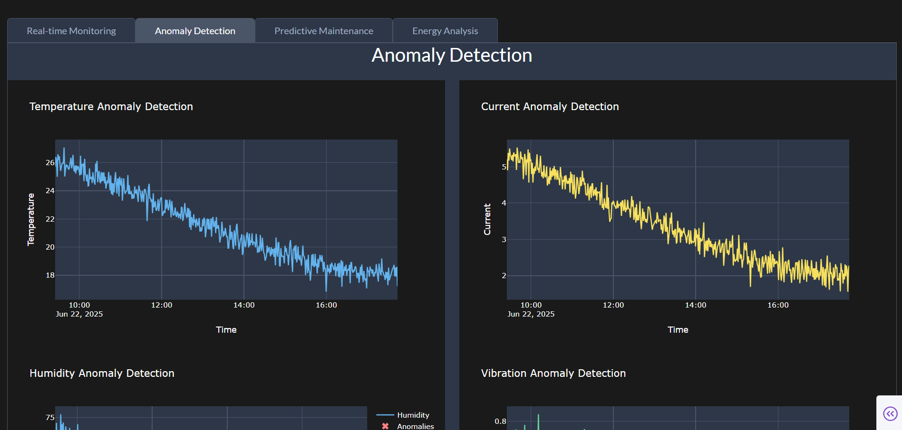

# Smart Monitoring System - ML and Visualization

This project implements machine learning models and visualization components for a smart monitoring system that analyzes temperature and current data from ESP32 sensors.

## Features

- Advanced Anomaly Detection using Isolation Forest and LSTM
- Predictive Maintenance using Random Forest
- Energy Consumption Analysis
- Real-time Visualization Dashboard
- Historical Data Analysis

## Project Structure

```
Render-2/
├── ml_models/           # Machine learning model implementations
├── data/               # Data storage and processing
├── web/               # Web interface and visualization
└── utils/             # Utility functions
```

# STEP 1: INSTALL PYTHON 3.10
# Make sure Python 3.10 is installed in your system.
# You can download it from: https://www.python.org/downloads/release/python-3100/

# STEP 2: INSTALL REQUIREMENTS
pip install -r requirements.txt

# STEP 3: RUN SIMULATED ARDUINO OUTPUT
# This simulates real-time sensor data and sends it to the system.
python arduino_integration/simulated_arduino_output.py

# STEP 4: TRAIN MACHINE LEARNING MODELS
# This script trains Isolation Forest, LSTM, and Random Forest models using the available dataset.
python data/train_models.py

# STEP 5: INSPECT AND VISUALIZE DATA
# This script provides visual analysis and inspection of the dataset used for anomaly detection.
python data/inspect_and_visualize.py

# STEP 6: RUN THE WEB APPLICATION
# This launches the web dashboard for real-time monitoring, anomaly detection, and visualization.
python web/app.py


## Components

### ML Models
- Anomaly Detection: Isolation Forest and LSTM-based models
- Predictive Maintenance: Random Forest for failure prediction
- Energy Optimization: Time series analysis and forecasting

### Web Interface
- Real-time data visualization
- Historical data analysis
- Anomaly alerts and predictions
- Interactive dashboards 

## Example Output Screenshots

Below are example outputs produced by this project:



 
